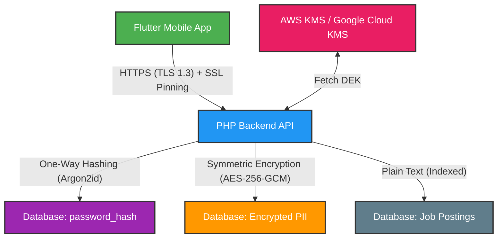

# Security Architecture Overview (UK Job Platform)

This document defines the security architecture and cryptography standards for our UK Job Platform. It ensures compliance with **UK GDPR (General Data Protection Regulation)** while keeping the system performant, searchable, and secure.

---

## 📌 Architecture at a Glance

Our strategy uses **Defense-in-Depth**. We classify data based on sensitivity and apply the appropriate cryptographic tool for each classification.

---

## 📊 Data Classification & Cryptographic Map

| Data Category | Examples | Security Requirement | Algorithm / Tool | Reversible? |
| :--- | :--- | :--- | :--- | :---: |
| **Passwords** | User Passwords | One-Way Hashing (No plain text stored) | **Argon2id** (with Salt + Pepper) | ❌ No |
| **Highly Sensitive PII** | Salaries, National Insurance (NI) Numbers, Passport scans, Bank details | Two-Way Encryption at rest | **AES-256-GCM** | ✅ Yes (with Key) |
| **Identity & Contact** | Full Name, Email, Phone Number | Plain text with strict access control | Plain text / Optional **SHA-256** for blind index lookup | ✅ Yes |
| **Public Platform Data** | Job Postings, Public Resumes, Company Descriptions | Plain text, fully indexable and searchable | **Plain text** (No encryption) | ✅ Yes |
| **System Secrets** | DB Credentials, Encryption Keys, Pepper | Kept out of database, rotate periodically | **KMS (Key Management)** / Vault | ✅ Yes |

---

## 🔒 1. User Passwords (One-Way Hashing)

> **Goal:** Secure passwords so that even if the database is completely leaked, passwords cannot be cracked or reversed.

* **Algorithm:** **Argon2id** (via `password_hash()` in PHP and `password_guard` in Flutter).
* **Salt:** Generated automatically by PHP per user and stored inside the hash string.
* **Pepper:** A server-side secret key mixed with the password before hashing. Kept in environment variables (`.env`) or Vault — never in the database.
* **Verification:** `password_verify($enteredPassword, $storedHash)`.

> [!IMPORTANT]
> **Argon2id is a one-way function.** It cannot be decrypted. The database only stores the secure hash.

---

## 💼 2. Highly Sensitive Data (Two-Way Encryption)

> **Goal:** Protect private data at rest while allowing the application to decrypt and display it back to the authorized user.

* **Algorithm:** **AES-256-GCM** (Advanced Encryption Standard with Galois/Counter Mode).
* **Why AES-256-GCM?** It provides **Authenticated Encryption**, meaning it detects if anyone has tampered with the encrypted data in the database.
* **Key Storage:** **Never** store the encryption keys in the database. Use:
  * Local development: `.env` file.
  * Production: AWS Key Management Service (KMS), Google Cloud KMS, or HashiCorp Vault.
* **Unique IVs:** A random Initialization Vector (IV) must be generated for every record. If two employees earn exactly the same salary (e.g., `£60,000`), their encrypted database records must look completely different.

---

## 🔎 3. Public Platform Data (Plain Text / Clear Text)

> **Goal:** High performance, fast database indexing, SEO indexing, and ease of searching.

* **Strategy:** No encryption at rest at the database column level.
* **Examples:** Job titles, job descriptions, city/location, employer names, and public resume details.
* **Why?**
  * If you encrypt job descriptions, candidates cannot search for terms like "Flutter Developer".
  * Search engines (Google Jobs, Indeed) cannot index your site.
  * Databases cannot perform indexes on encrypted text, making queries extremely slow.
* **Protection:** Secure this data via **API Authorization** (e.g., blocking unauthorized scrapers and ensuring users must log in to view candidate details).

---

## 🌐 4. Network Security (Data in Transit)

To ensure no one can sniff or read data sent between the Flutter app and the PHP server:

### A. HTTPS (TLS 1.3)
All endpoints must enforce HTTPS. TLS automatically encrypts the entire HTTP payload (headers, JSON body, path) using a public/private key handshake.

### B. SSL Pinning in Flutter
To prevent **Man-in-the-Middle (MITM)** attacks (where hackers install custom root certificates on a mobile device to read HTTPS traffic):
* Pin the server's certificate or public key hash directly in the Flutter app.
* The Flutter app will reject any connection if the certificate does not match the pinned key.

---

## ⚙️ How to Explain to the Backend Team (Cheat Sheet)

1. **"Use the right tool for the job":** Do not try to write custom hashing/encryption. Use native PHP `password_hash()` for passwords, and PHP `openssl_encrypt()` with `aes-256-gcm` for sensitive column data.
2. **"Don't encrypt search fields":** If we need to search for a job by location, do not encrypt the `location` column.
3. **"Rotate Keys & Secrets":** The pepper for passwords and the key for AES-256 must reside in the environment or Key Management Services (KMS), never in the database or source code repository.
4. **"Enforce TLS 1.3 & API Authentication":** The network is secured by TLS. The API is secured by proper JWT/token authorization.
